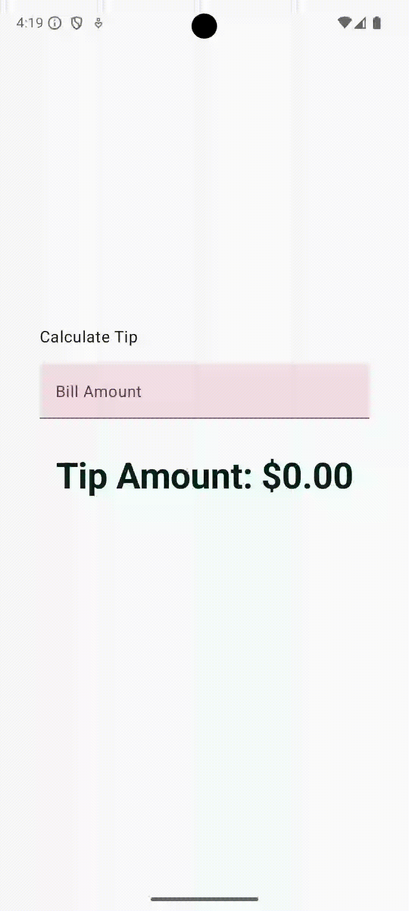
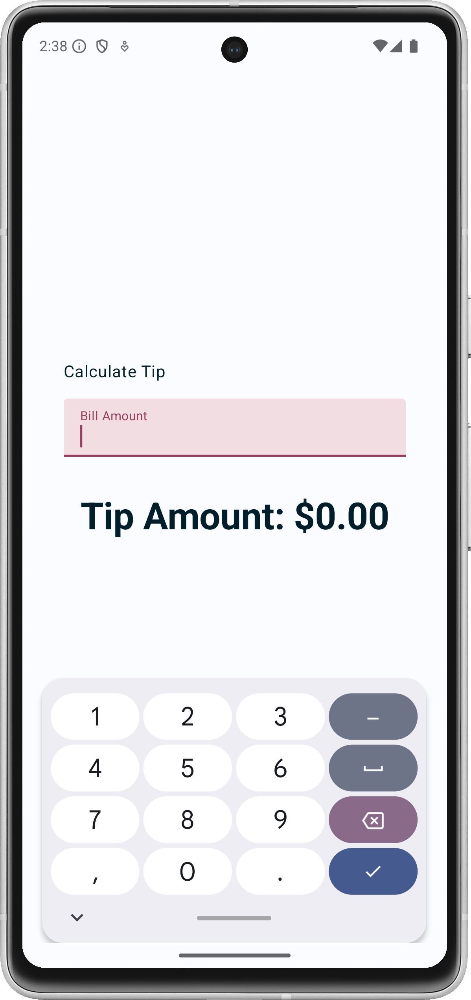

Tip Time
=================================

[Android Basics with Compose](https://developer.android.com/courses/android-basics-compose/course):  
A tip-calculator app called Tip Time that calculates a tip amount based on the service amount.

Introduction
------------
The Tip Time app contains various UI elements for calculating a tip. 
Creating this app involved thinking about state in a UI and how Compose uses state to display data.  

Some key concepts covered in this app are:
* Hoisting state.
* User input.

Demo
---------------

<!--  -->